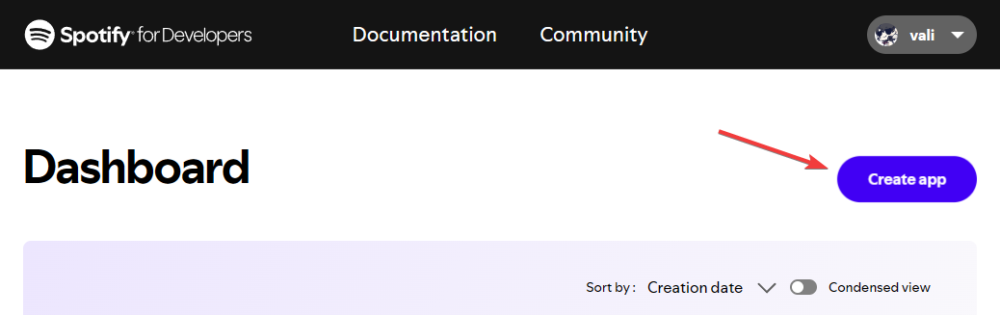
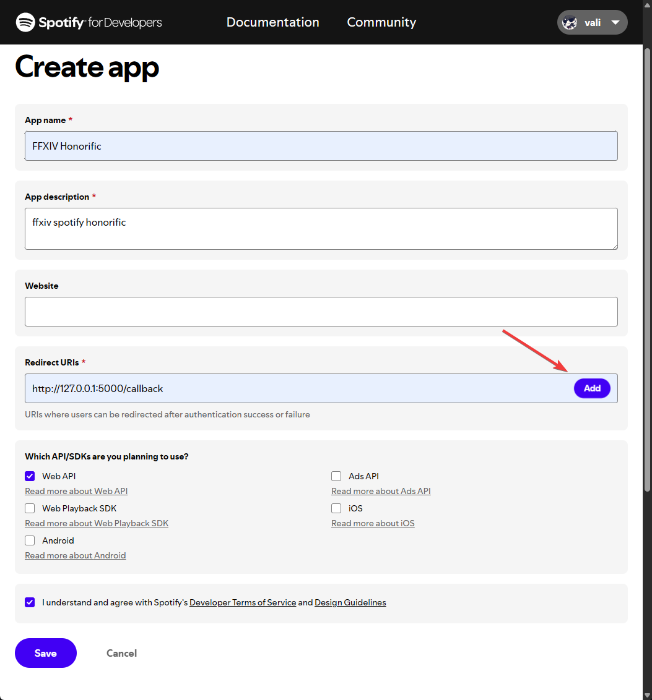
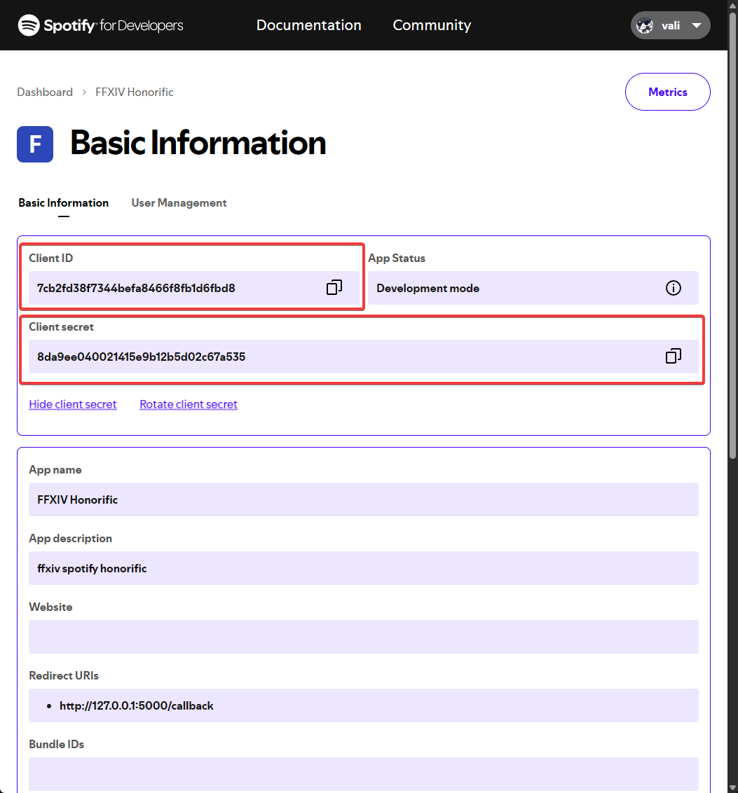

# SpotifyHonorific

[](https://github.com/Valiice/SpotifyHonorific/releases)
[](https://github.com/Valiice/SpotifyHonorific/releases/latest)
[](LICENSE.md)
[](https://github.com/Valiice/SpotifyHonorific/issues)

**SpotifyHonorific** is a Dalamud plugin for Final Fantasy XIV that dynamically updates your character's honorific title based on the track you are currently listening to on Spotify.

It supports customizable templates, rainbow gradients, and glow effects.

## ⚠️ Prerequisites

**This plugin relies on IPC to function.** You must have the following plugin installed from the standard Dalamud repository:
* **Honorific** (by Caraxi)

## Installation

1.  Add my custom plugin repository: [https://github.com/Valiice/DalamudPluginRepo](https://github.com/Valiice/DalamudPluginRepo)
2.  Search for **SpotifyHonorific** in the Plugin Installer.
3.  Install and Enable.

## Setup Guide

To connect the plugin to your Spotify account, you need to create a simple "App" in the Spotify Developer Dashboard to get a Client ID and Secret.

### 1. Create a Spotify App
1.  Go to the [Spotify Developer Dashboard](https://developer.spotify.com/dashboard) and log in.
2.  Click the **"Create app"** button.



### 2. Configure the App
1.  **App Name:** Enter a name (e.g., "FFXIV Honorific").
2.  **App Description:** Enter a short description (e.g., "FFXIV integration").
3.  **Redirect URIs:** **Important!** You must enter the exact URI:
    `
    http://127.0.0.1:5000/callback
    `
4.  Click **Add** next to the URI box.
5.  Under "Which API/SDKs are you planning to use?", check the box for **Web API**.
6.  Scroll to the bottom and click **Save**.



### 3. Get Your Credentials
1.  Once the app is created, click the **Settings** button (or "Basic Information").
2.  Locate the **Client ID** and **Client Secret**. (You may need to click "View client secret").
3.  Keep this page open, you will need to copy these strings.



### 4. Authenticate In-Game
1.  Open the plugin settings in FFXIV using `/spotifyhonorific config`.
2.  Paste your **Client ID** and **Client Secret** into the respective fields.
3.  Click the **"Authenticate with Spotify"** button.
4.  A browser window will open requesting permission. Accept it.
5.  Once successful, the plugin status will change to **Green/Authenticated**.

---

## Features & Configuration

You can customize how your title looks using [Scriban](https://github.com/scriban/scriban) templates.

### Basic Options
* **Rainbow Mode:** Cycles the color of the title through the RGB spectrum.
* **Glow:** Adds a glow color behind the title.
* **Prefix:** If checked, the text appears before your name. If unchecked, it acts as a standard title (after your name).
* **AFK Detection:** Automatically stops polling Spotify when your character goes AFK to save resources.

### Template Variables
When writing your Title Template, you can use the following variables:

| Variable | Type | Description |
| :--- | :--- | :--- |
| `Activity.Name` | String | The name of the track. |
| `Activity.Artists` | List | A list of artists on the track. |
| `Activity.Album.Name` | String | The name of the album. |
| `Activity.DurationMs` | Int | Total duration of the track in milliseconds. |
| `Activity.Popularity` | Int | The popularity score (0-100). |
| `Context.SecsElapsed` | Double | Seconds elapsed since the song started/plugin updated. |

### Example Templates

**Simple Artist - Song**
```scriban
{{ Activity.Artists[0].Name }} - {{ Activity.Name }}
````

**Truncate long names (Max 32 chars)**

```scriban
{{ Activity.Name | string.truncate 30 }}
```

**Scrolling Text Effect (Default)**
This cycles between "Listening to Spotify", the Song Name, and the Artist Name every 10 seconds.

```scriban
♪{{- if (Context.SecsElapsed % 30) < 10 -}}
    Listening to Spotify
{{- else if (Context.SecsElapsed % 30) < 20 -}}
    {{ Activity.Name | string.truncate 30 }}
{{- else -}}
    {{ Activity.Artists[0].Name | string.truncate 30 }}
{{- end -}}♪
```

## Commands

  * `/spotifyhonorific config` - Opens the configuration and settings window.

## Troubleshooting

  * **Title not appearing?** Ensure you have the **Honorific** plugin (by Caraxi) installed and enabled.
  * **"Spotify client is null"?** Your authentication token may have expired. Go to the config and click "Authenticate with Spotify" again.
  * **Not updating while AFK?** By default, the plugin stops polling Spotify when your character is AFK to save resources. You can disable this in the settings.

## License

This project is licensed under the GNU Affero General Public License v3.0. See [LICENSE](LICENSE.md) for details.